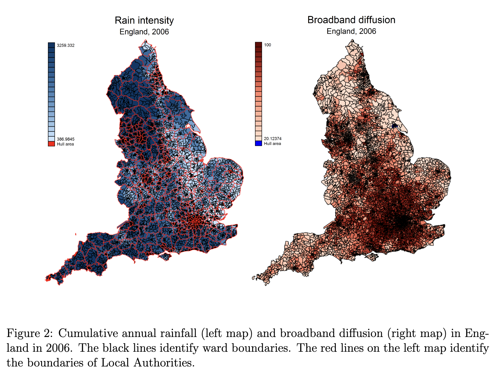

## Exercice 1 : Internet and turnout

This exercise is inspired from Gavazza, Nardotto, and Valletti (2017) : **Internet and Politics: Evidence from U.K. Local Elections and Local Government Policies**. You are interested in analysing the effect of internet diffusion on voter turnout. A key concern is that internet access is endogenous: areas with higher civic engagement or socioeconomic status may both adopt the internet faster and have higher turnout.

To address this, you use an instrumental variable strategy based on rainfall. Bad weather affects the quality and diffusion of broadband infrastructure, but is plausibly unrelated to voter turnout except through internet access.

You are provided with data (simulated) on wards in the UK, with the following codebook :

- turnout: voter turnout rate
- internet: broadband penetration in the ward (%)
- rain: rainfall (instrument)
- rain2: squared rainfall
- income : median income in the ward
- graduates : % of graduates in the ward
- unemployment : % of unemployed
- urban : whether 

You are asked to evaluate the causal effect of having access to the internet on political participation. A key concern is that internet access is endogenous: areas with higher socioeconomic status or civic engagement may both adopt broadband earlier and exhibit higher voter turnout. To address this issue, you use rainfall as an instrumental variable, exploiting the fact that during the broadband installation period, rainfall was a strong predictor of broadband penetration. This relationship is illustrated in the accompanying figure from Gavazza, Nardotto, and Valletti (2017).

1. Import the data set from <https://github.com/paulservais-1/methods_policyevaluation/raw/main/data/turnout_internet.dta>, and briefly summarise the variables. What will be your dependent variable ?
2. Estimate the relationship between internet penetration and voter turnout using OLS. Does that regression allow you to derive causal claims ? Why might this estimate be biased? What sources of endogeneity could be present?
3. Include income, graduates, unemployment, and urban status, as control variables. Do your estimates change ?
4. Estimate the relationship:
\begin{equation}
\text{internet}_i =\pi_0+ \pi_1+ \text{rain}_i + \text{rain}^2_i+\delta X_i+ u_i
\end{equation}

- What stage is this ? How many instruments do you have ?
- Is your instrument binary or continuous ?

5. Manually store the relevant fitted values and run a second linear regression model to finalise your causal estimation, using `lm`. What do you observe ?
6. Use `library(AER)` to run your full 2SLS, using `ivreg()`. Compare your results.
7. Perform and interpret the following diagnostic tests on your regression : 
  - Weak instrument test
  - Wu-Hausman test
  - Sargan test
8. How could you run falsification tests ? 

## Exercice 2: Education and earnings

You are interested in analysing the effects of education on future earnings (do more educated people earn more money). To address the potential endogeneity, they need an instrument that affects years of education without being influenced by other factors like ability or family background. They use the **compulsory schooling law**, which creates differences in school timing based on birth date. Children born early in the year start school older than those born later, and because of the minimum school-leaving age, early-born children (in the year) can legally leave school sooner than late-born children. This generates variation in education that is largely independent of individual characteristics. You can import the data from <https://github.com/scpo-quantimethods/quantitative_methods_two/raw/main/exercices/exercices5/data/angrist_krueger.dta>.

1. Import the data set. 

2. The code book is the following. The data set contains data about men’s earnings in 1980 (census extract):

- `log_wage` : log weekly wage
- `education` : years of schooling
- `yob`: year of birth
- `qob`: quarter of birth
- `sob`: state of birth

3. Run the first-stage regression, regressing education on the quarter of birth. Is the instrument working ?
Is it strong ? How much is the F-statistic ?

4. Run the two-stage regression, regressing the wage using the fitted values of education. How can you interpet that result ? 

5. Run the 2SLS using the `ivreg` estimator. Have a look at the diagnostic using `summary(two_sls, diagnostics = TRUE)` and interpret those. Are the estimates different ?

6. Run the 2SLS using the `ivrobust()` estimator. Do you notice something different in the estimates or their standard deviations ?

7. Re-run the IVs using the year of birth as additional control. Is the result changed ?

