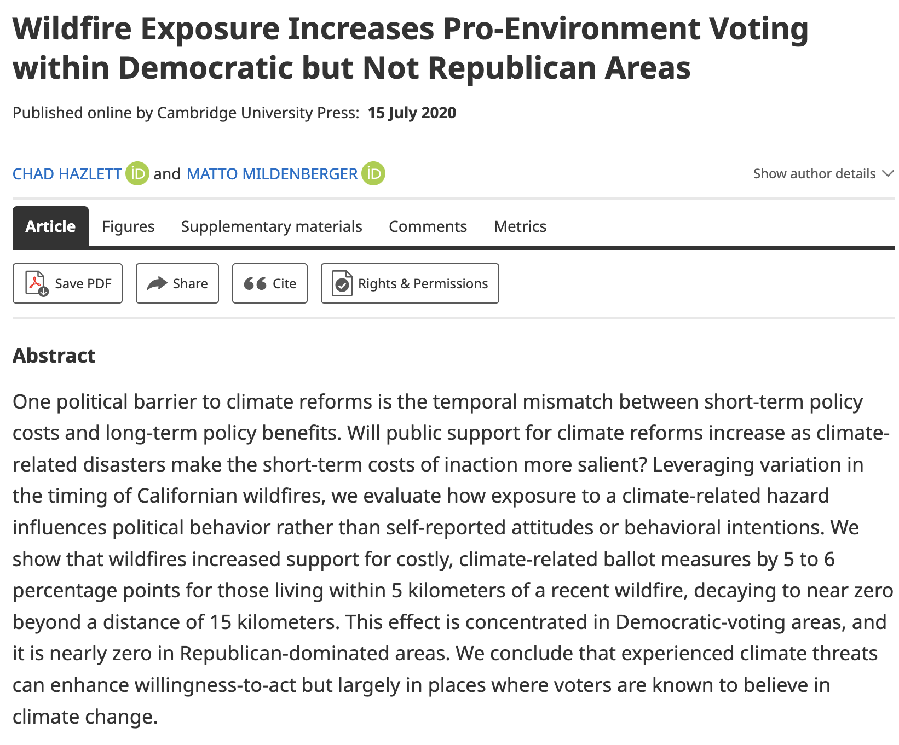
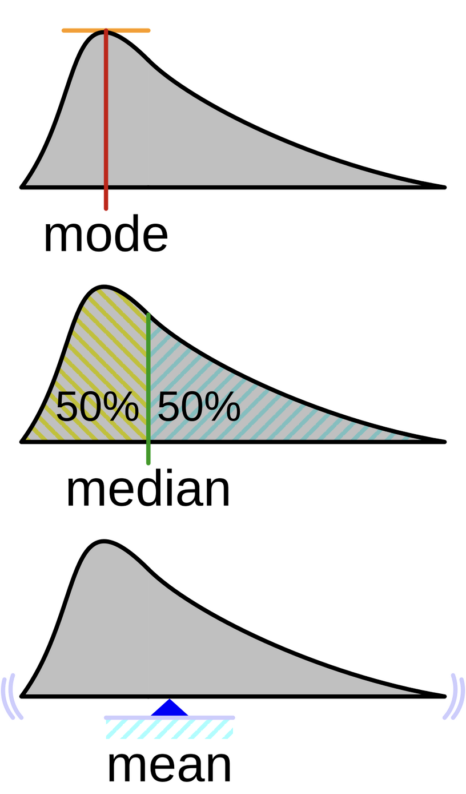

---
title: "Methods for Research and Policy Evaluation"
subtitle: "Session 1"
footer : "Session 1 - Methods for Research and Policy Evaluation"
author: "Paul Servais"
format: 
  revealjs:
    logo: images/scpo.png
---

# Introduction

## Your instructor
- Paul Servais, <paul.servais@sciencespo.fr>. 
- Trained as physical engineer (Ecole Polytechnique de Bruxelles), then came to SciencesPo (Urban School), graduated last year
- Now working on climate politics, comparative politics
- I've been working on the electoral impacts of wind turbines on the vote for the RN

## Course objectives
:::{.incremental}
- Provide you with skills useful for:
  - Policy Evaluation
  - Quantitative research 
  - With mathematical formalisation
  - Based on coding in R (on RStudio), with some Stata examples
- Correlation is not causation ! 
:::

## Course organisation

- 10' introduction
- 30' mathematical formalisation and coding examples
- 1h maths and coding exercices on R

## And you ? 
- Background ?  
  - math, statistics, coding 
- Objectives for the class ?


## Course material 
:::{.fragment}
- Everything on <https://paulservais-1.github.io/methods_policyevaluation/>
- More structured than Moodle
:::
:::{.fragment}
- Sessions, with clear codings outputs
- Exercices
{width=100%}
:::

## AI 

## R and RStudio
- Did you manage to install it ?
  - open-source
  - wide community
  - free
 
## Course evaluation

- Simple pass/fail 
- Replicate or find a research question, by groups of two, and write a 5-pages document summarising the findings
- Abstract 
- Intro - Theory - Methods - Results - Conclusion
- The objective is clearly not to overload anybody with work, but to give useful tips and skills for the future ! 


## Examples paper
<div style="display: flex; justify-content: space-around;">
  
  
</div>

## Sessions

- 1. Coding basics, and descriptive statistics
- 2. Linear regressions 
- 3. Non-linear regressions
- 4. Regression Discontinuity Design (RDD)  
- 5. Difference-in-differences (DiD) and panel data 
- 6. Instrumental Variables (IV)

## Other excellent sources
- Work by colleagues of my center (CEE) :
  - <https://luissattelmayer.github.io/quant-2025/> ; 
  - <https://malo-jn.quarto.pub/introduction-to-r/> ; 
  - <https://www.rovny.org/methods-2-ed>
  - 
- Work by other economists :
  - Cunningham, Scott. Causal Inference: The Mixtape. (2021). Available at: <https://mixtape.scunning.com/>.  
  - Huntington-Klein. The Effect: An Introduction to Research Design and Causality. (2021). <https://theeffectbook.net/>
  - <https://scpoecon.github.io/ScPoEconometrics/R-intro.html>
 
## Questions ? 

# Coding basics


## Motivation
- Our world is increasingly measured and monitored systematically
- This creates loads of data about almost everything
- The objectives of statistics is to find meaningful information in those data 
- Yet most of the time the data is imperfect or limited, in terms of reach, validity, and in terms of reliability
- Need to idenfity **margins of validity** !


## Research problem and empirical evidence 
- A research puzzle generally comes with identifying a puzzling relationship between two variables
- Why Y despite X ? Because Z
- A more empirical question would also be: does Z affect Y ?
- Quantitative methods, and causal inference, are a way to assess the size of the effect of Z on Y and to measure its significance.


# Descriptive statistics

## Descriptive statistics
- The first step in every statistical analysis
- Describe the variables we work with
  - remove outliers, deal with missing values
  - verify the quality of the data
    - range
    - mean
    - median
    - standard deviation
    - density

## Structure

1. Intuitive examples
  - Examples with dices
  - Definitions : mean, variance, median, deciles
2. Real-life application 

## Random variables
- A variable with random outcomes, is called a random variable : eg. a census is generally built on a sample of individuals, randomly drawn from an overall population.
- Categorical : finite amount of values/categories
  - Nominal : non-ordered eg. gender, the department where you live
  - Ordinal : ranking of preferences eg. ranking your preferences from 1 to 5
- Continuous/interval variables : infinite number of potential outcomes (in a given range)

## One dice example
- A typical example is the result of a six-faces dice, that you roll.
- $X$, the result of your dice, is a random variable
- $S_X = \{1,2,3,4,5,6\}$ is its set of potential outcomes
- If your dice is not broken, $P(X =1,2,3,4,5,6) = 1/6 \approx 0.1666667$. 
- The probability set is $P_X = \{1/6, 1/6, 1/6, 1/6, 1/6, 1/6\}$ (number of favorable cases/total number of cases). Each outcome comes with a probability.
- How could we test that ?

## One dice example - distribution
- You throw it a 1000 times. I randomly generate that variable in R, using `sample()`
```{r}
#| echo: true

N = 1000 #number of measurements
x1 = sample(1:6,N, replace=T) # first dice (values are from 1 to 6)
head(x1,20) # head
```

## Your experiment
```{r}
#| echo: true

barplot(table(x1))
```

## Your experiment 
- N = 100000
```{r}
#| echo: true

barplot(table(x1 = sample(1:6,100000, replace=T)))
```

## Your experiment 
- Normalised
```{r}
#| echo: true

barplot(table(x1 = sample(1:6,100000, replace=T))/100000)
```


## Law of large numbers
- When N gets very big, the frequency converges to the probability
```{r}
#| echo: false
#| eval: true

library(tidyverse)
Nn = c(1:100, seq(from = 100, to = 100000, by = 100))
a = 0
val = 0
freqb <- data.frame(Nn = Nn, val = 0)

freqb <- freqb %>%
  rowwise() %>%
  mutate(val = {
      sums <- sample(1:6, Nn, replace = TRUE)
      freq_table <- table(sums)
      if ("3" %in% names(freq_table)) {
        freq_table["3"] / Nn
      } else {
        0
      }
    }
  ) %>%
  ungroup()
ggplot(data = freqb, aes(x = log(Nn), y = val))+geom_point()+geom_line()
```
## Summing probabilities
- The probability of obtaining a value $\le$ 4 is the union of all the probabilities :
\begin{equation}
P(X=1) + P(X=2) + P(X=3) + P(X=4) = 4/6
\end{equation}
- It is written as a sum
## Two dices example 
- Now imagine that you have two dices
- $X_1$ is the result of dice 1, $X_2$ is the result of dice 2
- $Y = X_1 + X_2$ is also a random variable;
- If $X_1$ and $X_2$ are independent and can be distinguished (e.g. different colors)
\begin{equation}
P(Y_{ij}) = P(X_1 = i)\times P(X_2 = j)
\end{equation}
- $S = \{2,3,4,5,6,7,8,9,10,11,12\}$
- Yet here $X_1$ and $X_2$ are interchangeable... Probabilities = ?

## Two dices example 
\begin{array}{c|cccccc}
 & 1 & 2 & 3 & 4 & 5 & 6 \\
\hline
1 & \frac{1}{36} & \frac{1}{36} & \frac{1}{36} & \frac{1}{36} & \frac{1}{36} & \frac{1}{36} \\
2 & \frac{1}{36} & \frac{1}{36} & \frac{1}{36} & \frac{1}{36} & \frac{1}{36} & \frac{1}{36} \\
3 & \frac{1}{36} & \frac{1}{36} & \frac{1}{36} & \frac{1}{36} & \frac{1}{36} & \frac{1}{36} \\
4 & \frac{1}{36} & \frac{1}{36} & \frac{1}{36} & \frac{1}{36} & \frac{1}{36} & \frac{1}{36} \\
5 & \frac{1}{36} & \frac{1}{36} & \frac{1}{36} & \frac{1}{36} & \frac{1}{36} & \frac{1}{36} \\
6 & \frac{1}{36} & \frac{1}{36} & \frac{1}{36} & \frac{1}{36} & \frac{1}{36} & \frac{1}{36}
\end{array}

## Distribution
```{r}
#| echo: true

N = 10000 #number of measurements
x1 = sample(1:6,N, replace=T) # first dice (values are from 1 to 6)
x2 = sample(1:6,N, replace=T) # first dice (values are from 1 to 6)
y = x1 + x2
head(y)
mean(y)
sd(y)
summary(y)
```


## Expectation and variance 
- The expectation is the average value that will come out of your dice: 
\begin{equation}
\text{E}(Y) = \sum_{i=1}^N Y_i * P(Y_i) = \bar{Y}
\end{equation}

```{r}
#| echo: true
mean(y)
```

## Expectation and variance
- And you want to measure the average dispersion around the mean called the variance :
\begin{equation}
\text{E}((Y_i-\bar{Y})^2) = \frac{1}{N} \sum_{i=1}^N (Y_i - \bar{Y})^2 = \sigma^2
\end{equation}
- This is a measure of "dispersion" (around the mean)
```{r}
#| echo: true
var(y)
```

## Visualising the variance
- For N = 100
```{r}
#| echo: false
#| eval: true
N = 100 #number of measurements
x1 = sample(1:6,N, replace=T) # first dice (values are from 1 to 6)
x2 = sample(1:6,N, replace=T) # first dice (values are from 1 to 6)
y = x1 + x2
rand <- data.frame(y)
rand$devs <- (rand$y - mean(y))^2
rand$num <- as.numeric(rownames(rand))

ggplot(rand, aes(x=num, y = y)) +geom_point()+ geom_hline(yintercept = mean(y), linetype = "dashed", color = "red") +scale_x_continuous(breaks = seq(1, max(rand$num), by = 20)) + 
  scale_y_continuous(breaks = 2:12) +  
  geom_segment(
    aes(x = num, xend = num, y = y, yend = mean(y)),
    color = "blue", alpha = 0.3
  ) + theme_minimal()

```

## Conditional probability 
- Now imagine that you know the value of one dice, but not the other.
- Imagine $X_1 =4$. 
- $S_Y = \{5,6,7,8,9, 10\}$
- What are the probabilities ? 
\begin{equation}
P(Y|X_1 = 4) = \frac{1}{6}
\end{equation}
- Hence, knowing $X_1$ considerably influences the probabilities on Y!

## Conditional expectation
::: {.fragment}
- Knowing $X_1 = 4$ therefore also changes the expectation :
\begin{equation}
\text{E}(Y|X_1 = 4) = \frac{1}{6}(5+6+7+8+9+10) = 7.5
\end{equation}
:::

::: {.fragment}
```{r}
#| echo: true

N = 10000 #number of measurements
x1 = 4 # first dice (values are from 1 to 6)
x2 = sample(1:6,N, replace=T) # first dice (values are from 1 to 6)
y = x1 + x2
```
:::

## Conditional distribution
```{r}
barplot(table(4+x2)/N)
```

## Towards continuity
- You have 1000 dices, with $i = 1,2,3,..., 1000$ faces. 
- Values are all divided by $i$.
- You randomly pick 100 of these, 
- You throw each of them 10000 times
- You report the sum as random variable Y

## Your experiment
```{r}
#| echo: true 
N = 10000 #number of measurements
x = sample(1:1000,100, replace=T) # your hundred dices
head(x)
y =0
for(i in x){y = y+sample(1:i, N, replace = T)/i}
head(y)
```

## Probability density function (pdf)
```{r}
#| echo: false
#| eval: false
library(ggplot2)
dat = data.frame(y)
ggplot(dat, aes(x = y)) +
  geom_histogram(aes(y = after_stat(density)), bins = 100) +
  geom_density(color = "red", linewidth = 1) +
  labs(title = "Distribution of Y",
       x = "Y",
       y = "Density") +
  theme_minimal()

```

```{r}
#| echo: false
#| eval: true
library(ggplot2)
dat = data.frame(y)
library(ggplot2)

# Calculer la moyenne et l'écart-type
mu <- mean(dat$y, na.rm = TRUE)
sigma <- sd(dat$y, na.rm = TRUE)

# Calculer la densité pour obtenir les valeurs de densité à mu - sigma et mu + sigma
d <- density(dat$y)
dens_at_mu_minus_sigma <- approx(d$x, d$y, xout = mu - sigma)$y
dens_at_mu_plus_sigma <- approx(d$x, d$y, xout = mu + sigma)$y

# Créer le graphique
ggplot(dat, aes(x = y)) +
  geom_histogram(aes(y = after_stat(density)), bins = 100, fill = "lightblue", alpha = 0.5) +
  geom_density(color = "red", linewidth = 1) +
  # Ajouter un segment horizontal entre mu - sigma et mu + sigma, à la hauteur de la densité
  geom_segment(
    aes(x = mu - sigma, xend = mu + sigma, y = dens_at_mu_minus_sigma, yend = dens_at_mu_minus_sigma),
    color = "darkgreen", linewidth = 1.5
  ) +
  # Ajouter des lignes verticales pour marquer mu, mu - sigma et mu + sigma
  geom_vline(xintercept = mu, color = "darkgreen", linetype = "dashed", linewidth = 0.8) +
  geom_vline(xintercept = mu - sigma, color = "orange", linetype = "dotted", linewidth = 0.8) +
  geom_vline(xintercept = mu + sigma, color = "orange", linetype = "dotted", linewidth = 0.8) +
  # Ajouter des annotations pour clarifier
  annotate("text", x = mu, y = max(d$y) * 1.05, label = paste0("μ = ", round(mu, 2)), color = "darkgreen") +
  annotate("text", x = mu - sigma, y = max(d$y) * 1.05, label = paste0("μ - σ = ", round(mu - sigma, 2)), color = "orange") +
  annotate("text", x = mu + sigma, y = max(d$y) * 1.05, label = paste0("μ + σ = ", round(mu + sigma, 2)), color = "orange") +
  labs(
    title = "Distribution of Y (μ ± σ intervals)",
    x = "Y",
    y = "Densité"
  ) +
  theme_minimal()

```

## Probability density function (pdf)

- You now get closer to a continuous random variable...
- Your probability to obtain one specific value (eg. X = 52.503) becomes extremely small.
- Your density is a probability density function, $f$
- You generally rather assess the probability that the value you pick is bigger or smaller than a certain value

## Probability density function (pdf)
- $P(X \le 52.503) = \int_{\text{min(R)}}^{52.503} f_X(x') \text{d}x'$
```{r}

# Calculer la densité une seule fois
d <- density(dat$y)
dens_df <- data.frame(x = d$x, y = d$y)

# Trouver l'indice où x ≈ 43.503
cutoff <- 52.503
dens_df$color <- ifelse(dens_df$x <= cutoff, "red", "gray")

# Créer le graphique
ggplot(dat, aes(x = y)) +
  geom_histogram(aes(y = after_stat(density)), bins = 100, fill = "lightblue", alpha = 0.5) +
  geom_density(color = "black", linewidth = 0.5) +  # Courbe noire pour la référence
  geom_ribbon(
    data = dens_df,
    aes(ymin = 0, ymax = y, x = x, fill = color),
    alpha = 0.5, show.legend = FALSE
  ) +
  scale_fill_identity() +
  labs(
    title = "Distribution of Y",
    x = "Y",
    y = "Densité"
  ) +
  theme_minimal()
``` 

## Many pdfs... depends on your data !
<div style="display: flex; justify-content: space-around;">
  
  
</div>
# Coding reminder and real examples

## Real-life examples
::: {.fragment}
- Of course in practice dices are not extremely interesting...
- But the same logic applies to real data ! 
- Imagine working on the French communes
- You seek to describe the median income in those communes 
- You only have access to a random sample of 10.000
- You will need a coding environment : RStudio (open source, free, huge community)
- and data... : your task is to find it online
:::

## Coding environment
- Language : R (CRAN)
- Environment : RStudio
- See documentation on:
  - Malo Jan's webpage <https://malo-jn.quarto.pub/introduction-to-r/>
  - R documentation
  
## Creating a project 
- Create a project :

{width=100%}

## Creating a project
- Project/folder creation 
<div style="display: flex; justify-content: space-around;">
  
  
</div>

## Data and packages
- R comes with basic language and functions : base R
  - you can add, multiply, conduct basic operations in your files
- I strongly recommend the use of packages and libraries
  - `tidyverse` is **extremely** useful
- You can load and install such packages in this way :
```{r}
#| echo: true
#| eval: false
install.packages("tidyverse")
library(tidyverse)
```

## Importing data
:::{.fragment}
```{r}
#| echo: true
#| eval: false
library(readxl) # needed to read excel without "rio"
communes <- read_excel("data/demographics2024.xlsx") # relative path
communes <- read_excel("/Users/Desktop/Website/methods_policyevaluation/slides/session1/data/") # absolute path
#using the "rio" package
library(rio)
communes <- import("data/demographics2024.xlsx")
```
:::

```{r}
library(readxl)
library(tidyverse)
communes <- read_excel("data/demographics2024.xlsx") # relative path

len_com <- length(communes %>% pull(codecommune))
sample_com <- sample(1:len_com, N, replace = FALSE)
comms_rand <- NULL
a <- 0
for(i in sample_com){
  a =a+1
  comms_rand[a] = (communes %>% pull(codecommune))[i]}
comm_r <- communes %>% filter(codecommune %in% comms_rand) 
```
::: {.fragment}
- Inspecting the data
```{r}
#| echo: true
head(comm_r, 3)
```
:::

## Absolute path 

{width=50%}

## Categorical variable
- Density typology
```{r}
#| echo: true
# Nominal : the density typology of communes 
unique(comm_r$dens)
table(comm_r$dens)
summary(comm_r$dens)
```
- Nominal or ordinal ?

## Interval variable
- Median income in communes
```{r}
#| echo: true
# Continuous : the median income in those communes
summary(comm_r$revmoyfoy)
range(comm_r$revmoyfoy, na.rm = TRUE)
summary((comm_r %>% drop_na(revmoyfoy))$revmoyfoy) #dropping NA's
#replacing the NA's
comm_r <- comm_r %>% mutate(revmoyfoy = ifelse(is.na(revmoyfoy), mean(revmoyfoy, na.rm =TRUE), revmoyfoy))
summary(comm_r$revmoyfoy)
```

## Density
```{r}
#| echo: true
mu <- comm_r %>% select() %>% group_by()
ggplot(comm_r, aes(x= revmoyfoy, color = dens)) + geom_density()
```

## Skewness 
- $\text{Ages} =\{13,15,15,16,16,17,13,15,17, 18, 55\}$
- $\text{Med}_{\text{Age}} = 16$ and $\bar{\text{Age}} = 19.09$
- The mean is very sensitive to extreme values !
- Median $<$ Mean : positively skewed (the mean is pushed upwards by high values)
- Median $>$ Mean : negatively skewed (the mean is pushed downwards by low values)
- Mean = Median : symmetrical distribution

## Skewness
- Logging a positively skewed variable can make it more symmetrical
```{r}
#| echo: true
ggplot(comm_r, aes(x= log(revmoyfoy), color = dens)) + geom_density()
```

## Expectations
- You can compute the expectation:
\begin{equation}
\text{E}(\text{MI}) = \frac{1}{10000}\sum_{i=1}^{10000} \text{MI}_i 
\end{equation}
```{r}
#| echo: true
mean(comm_r$revmoyfoy)
```
- And the conditional expectations
```{r}
#| echo: true
mean((comm_r %>% filter(dens == "Rural"))$revmoyfoy)
mean((comm_r %>% filter(dens == "Urbain dense"|dens == "Urbain intermédiaire"))$revmoyfoy)
```

## Statistical inference
- You see : 

\begin{equation}
\text{E}(\text{MI}| \text{dens} = \text{Rural}) \le \text{E}(\text{MI}) 
\end{equation}

- Should we conclude that median income is significantly smaller in rural communes than in urban areas ? 
- The density plot indeed shows that rural areas are more concentrated in the lower income regions, compared with urban areas...
- Yet dispersion quite large for urban areas... see notes

<!--
## Statistical inference
- I would like to be 95% sure that 
\begin{equation}
\text{E}(\text{MI}| \text{dens} = \text{Rural}) \le \text{E}(\text{MI}| \text{dens} = \text{Urban}) 
\end{equation}
- The t-test consists in computing a t-statistic comparing the means of the two independent samples : 
\begin{equation}
t = \frac{\bar{X_1} - \bar{X_2}}{\sqrt{\frac{s_1^2}{n_1}+\frac{s_2^2}{n_2}}}
\end{equation}

## Student's t-test
- Two means are indeed statistically similar, that means that the t value should be non discernible from 0, with the 99% level of confidence decided. 
- If different, the t-value should be significantly different than 0. Confidence interval defined at the 99% confidence level should not include 0 : 
\begin{equation}
(\bar{X_1} - \bar{X_2}) \pm t_{.99} * \sqrt{\frac{s_1^2}{n_1}+\frac{s_2^2}{n_2}}
\end{equation} 
```{r}
#| echo: true
#| eval: false

t_test_result <- t.test(
  rural_income,
  urban_income,
  alternative = "two.sided",
  conf.level = 0.99,
  var.equal = FALSE  # Use Welch's t-test for unequal variances
)
```
## Student's t-test

```{r}
#| echo: false
#| eval: true

rural_income <- comm_r %>% filter(dens == "Rural") %>% pull(revmoyfoy)
urban_income <- comm_r %>% filter(dens == "Urbain dense" | dens == "Urbain intermédiaire") %>% pull(revmoyfoy)

t_test_result <- t.test(
  rural_income,
  urban_income,
  alternative = "two.sided",
  conf.level = 0.99,
  var.equal = FALSE  # Use Welch's t-test for unequal variances
)
```
```{r}
t_test_result
```
"""
-->

## Exercices 

1. Manual warm-up
2. Playing with R Studio
3. Playing with ESS data
4. Playing with socio-demographic and electoral data in France


