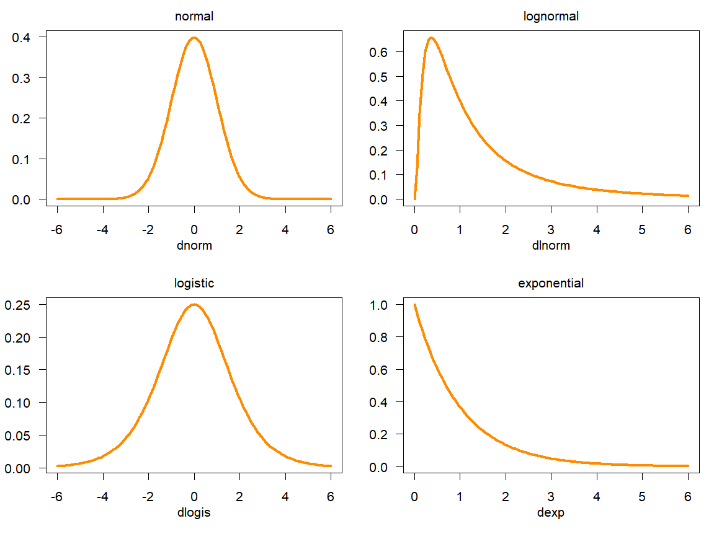

## General comments
- Your finals
  - emphasis on the question, the identification strategy, the limitations
  - NULL results are good too !
- The exercices of last session
- We will try to do 1h theory (code) + 1h exercices


## Content

-  Quick recap'
- Theory : 
  - Statistical inference
  - T-tests
  - OLS regression
- Exercices

## Last session

- We saw
- Descriptive statistics
  - **mean**, **median**, **variance**, **standard deviation**
  - **expectation**, **distribution**
  - **probability density function**
- How to code in R
  - `summary()`, `IQR()`, 
  - `hist()`, `ggplot()+geom_density()`, `barplot()`

## Last session {.scrollable}

- We saw for continuous variable $P(Y\le Y_0)$ (here 52.503)
```{r}
#| echo: false
N = 10000 #number of measurements
x = sample(1:1000,100, replace=T) # your hundred dices
#head(x)
y =0
for(i in x){y = y+sample(1:i, N, replace = T)/i}
#head(y)
```

```{r}
#| echo: false
#| eval: true 
library(ggplot2)
dat <- data.frame(y)
# Calculer la densité une seule fois
d <- density(dat$y)
dens_df <- data.frame(x = d$x, y = d$y)

# Trouver l'indice où x ≈ 43.503
cutoff <- 52.503
dens_df$color <- ifelse(dens_df$x <= cutoff, "red", "gray")

# Créer le graphique
ggplot(dat, aes(x = y)) +
  geom_histogram(aes(y = after_stat(density)), bins = 100, fill = "lightblue", alpha = 0.5) +
  geom_density(color = "black", linewidth = 0.5) +  # Courbe noire pour la référence
  geom_ribbon(
    data = dens_df,
    aes(ymin = 0, ymax = y, x = x, fill = color),
    alpha = 0.5, show.legend = FALSE
  ) +
  scale_fill_identity() +
  labs(
    title = "Distribution of Y",
    x = "Y",
    y = "Densité"
  ) +
  theme_minimal()
``` 

## Last session 

- And different distribution functions
{width=80%}

## The normal distribution {.scrollable}

```{r}
#| echo: false

library(ggplot2)
library(dplyr)
library(tidyr)

# Parameters for three normals
params <- data.frame(
  mu = c(500, 400, 350),
  sigma = c(100, 50, 150),
  dist = c("N(500, 100^2)", "N(400, 50^2)", "N3 (350, 150^2)")
)

# x-axis range
x <- seq(0, 800, length.out = 1000)

# Create long-format data frame for ggplot
dat <- params %>%
  rowwise() %>%
  mutate(y = list(dnorm(x, mean = mu, sd = sigma))) %>%
  unnest(c(y)) %>%
  mutate(x = rep(x, times = nrow(params)))

# Plot
ggplot(dat, aes(x = x, y = y, color = dist)) +
  geom_line(linewidth = 1.2) +
  labs(title = "Three Normal Distributions",
       x = "x",
       y = "Density") +
  theme_minimal() +
  scale_color_manual(values = c("red", "blue", "green"))

```

## The normal distribution

- Symmetric, not bounded, continuous
- mode = median = mean
\begin{equation}
f_N(x) = \mathcal{N}(x; \mu, \sigma) = \frac{1}{\sigma \sqrt{2\pi}} e^{-\frac{1}{2}(\frac{x-\mu}{\sigma})^2}
\end{equation}
- standard normal distribution
\begin{equation}
\mathcal{N}(z; 0, 1) = \frac{1}{\sigma \sqrt{2\pi}} e^{-\frac{1}{2}(\frac{z}{1})^2}
\end{equation}

## The normal distribution
\begin{equation}
\mathcal{N}(x; 1.5, 1)
\end{equation}
```{r}
#| echo: false
N = 100000 #number of measurements
x1 = sample(1:1000,N, replace=T)/1000 # first dice (values are from 1 to 6)
x2 = sample(1:1400,N, replace = T)/1400
x3 = sample(1:800,N,replace = T)/800
y = x1+x2+x3
dat <- data.frame(y)
d <- density(dat$y)
dens_df <- data.frame(x = d$x, y = d$y)

# Trouver l'indice où x ≈ 43.503
cutoff1 <- 1.0
cutoff2 <- 1.000001
dens_df$color <- ifelse((dens_df$x >= cutoff1 & dens_df$x <= cutoff2), "red", "green")

# Créer le graphique
ggplot(dat, aes(x = y)) +
  geom_histogram(aes(y = after_stat(density)), bins = 100, fill = "lightblue", alpha = 0.5) +
  geom_density(color = "black", linewidth = 0.5) +  # Courbe noire pour la référence
  geom_ribbon(
    data = dens_df,
    aes(ymin = 0, ymax = y, x = x, fill = color),
    alpha = 0.5, show.legend = FALSE
  ) +
  scale_fill_identity() +
  labs(
    title = "Distribution of Y",
    x = "Y",
    y = "Densité"
  ) +
  theme_minimal()
```

## The normal distribution
- $P(1 \leq X \leq 2) = \int_1^2 N(x; 1.5, 1) \text{d}x = P(X \leq 2) - P(X\leq 1)$
```{r}
#| echo: false
N = 100000 #number of measurements
x1 = sample(1:1000,N, replace=T)/1000 # first dice (values are from 1 to 6)
x2 = sample(1:1400,N, replace = T)/1400
x3 = sample(1:800,N,replace = T)/800
y = x1+x2+x3
dat <- data.frame(y)
d <- density(dat$y)
dens_df <- data.frame(x = d$x, y = d$y)

# Trouver l'indice où x ≈ 43.503
cutoff1 <- 1.0
cutoff2 <- 2
dens_df$color <- ifelse((dens_df$x >= cutoff1 & dens_df$x <= cutoff2), "red", "green")

# Créer le graphique
ggplot(dat, aes(x = y)) +
  geom_histogram(aes(y = after_stat(density)), bins = 100, fill = "lightblue", alpha = 0.5) +
  geom_density(color = "black", linewidth = 0.5) +  # Courbe noire pour la référence
  geom_ribbon(
    data = dens_df,
    aes(ymin = 0, ymax = y, x = x, fill = color),
    alpha = 0.5, show.legend = FALSE
  ) +
  scale_fill_identity() +
  labs(
    title = "Distribution of Y",
    x = "Y",
    y = "Densité"
  ) +
  theme_minimal()
```

## Statistical tables

- Integral difficult to compute...
- Take variable $(X- \mu)/\sigma= z$
\begin{equation}
P(z \leq (2-1.5)/1) = P(z \leq 0.5) = P(X \leq 2) \approx 0.69
\end{equation}
- Refer yourself to the statistical tables !


## Limitations
- Already gives hint on one variable
- but...
  - complete information on population
    - statistical inference
  - what about relationships ?
    - t-tests
    - simple and multiple regression


# Statistical inference 

## Statistical inference
- Goal = find information on population based on sample
```{r}
#| echo: false
#| fig-cap: "Population and Sample"
#| fig-width: 6
#| fig-height: 6

library(ggplot2)

# Données pour le grand cercle (population)
population <- data.frame(
  x = cos(seq(0, 2*pi, length.out = 100)),
  y = sin(seq(0, 2*pi, length.out = 100))
)

# Données pour le petit cercle (échantillon)
echantillon <- data.frame(
  x = 0.3 * cos(seq(0, 2*pi, length.out = 100)) + 0.5,
  y = 0.3 * sin(seq(0, 2*pi, length.out = 100)) + 0.5
)

ggplot() +
  # Grand cercle (population)
  geom_polygon(data = population, aes(x, y), fill = "lightblue", color = "blue", alpha = 0.5) +
  # Petit cercle (échantillon)
  geom_polygon(data = echantillon, aes(x, y), fill = "lightgreen", color = "green", alpha = 0.7) +
  # Légende
  annotate("text", x = 0, y = 1.2, label = "Population (N, mu, sigma)", size = 4) +
  annotate("text", x = 0.5, y = 0.8, label = "Sample (n, x, s)", size = 4) +
  # Paramètres graphiques
  coord_fixed(xlim = c(-1.2, 1.2), ylim = c(-1.2, 1.2)) +
  theme_void() +
  theme(plot.background = element_rect(fill = "white"))

```


## Statistical inference
- Goal = find information on population based on sample
- E.g. You want to estimate the average French income
- Asking every French person is difficult...
- Use a sample with reduced size !

## Estimation of parameters
- In general you seek to evaluate key parameters of your distribution
  - mean $\mu$,
  - standard deviation $\sigma$

- based on a sample


## Confidence interval
- Yet your sampling procedure is random 
- The mean of your sample, $\bar{X}$, is a random variable that could be used to estimate the actual mean $\mu$:
\begin{equation}
Z = \frac{\bar{x} - \mu}{\sigma / \sqrt{n}} \sim \mathcal{N}(0,1).
\end{equation}
- the statistical tables allow you to find the desired level of confidence !

## Confidence interval - knowing $\sigma$
- Yet your sampling procedure is random 
- The mean of your sample, $\bar{X}$, is a random variable that could be used to estimate the actual mean $\mu$:
\begin{equation}
Z = \frac{\bar{x} - \mu}{\sigma / \sqrt{n}} \sim \mathcal{N}(0,1).
\end{equation}

\begin{equation}
\bar{x} - z_{1-\alpha/2}\,\frac{\sigma}{\sqrt{n}} \le \mu \le \bar{x} + z_{1-\alpha/2}\,\frac{\sigma}{\sqrt{n}}
\end{equation}

## Confidence interval
\begin{equation}
\bar{x} - z_{1-\alpha/2}\,\frac{\sigma}{\sqrt{n}} \le \mu \le \bar{x} + z_{1-\alpha/2}\,\frac{\sigma}{\sqrt{n}}
\end{equation}

- Intuitively, precision:
  - increases with the size of sample $n$, 
  - decreases with the variation in the population $\sigma$ or $s$
  - decreases with when your confidence level increases

## Confidence interval - Example
- The average median income in French communes (log). 
- You know $\sigma$ 
- $\mu$ = ? 
```{r}
#| echo: true
library(readxl)
data_dem <- read_excel("data/demographics2024.xlsx")
log_median_inc <- log(data_dem$revmoyfoy)
sig <- sd(log_median_inc, na.rm = TRUE)
```

## Confidence interval 
- Sample of 40 communes

```{r}
#| echo: true
my_sample <- sample(log_median_inc, 40, replace = FALSE)
mean_x <- mean(my_sample, na.rm = TRUE)
sd(my_sample, na.rm =TRUE)
```
- with 95% confidence, your mean lies in :
```{r}
#| echo: true
mean_x - 1.96*sig/sqrt(40)
mean_x + 1.96*sig/sqrt(40)
mean(log_median_inc, na.rm = TRUE)
```

## Confidence interval 
- The randomness is on the sampling process ! If you repeat the process N times... 
- 95% of finding the actual mean within the interval !
- 5% of confidence intervals do not include the mean, due to randomness of sampling $\bar{x}$ !

## Confidence interval, 95%
```{r}
#| echo: false
log_median_inc <- na.omit(log_median_inc)
plot_ci <- function(data, sample_siz, n_samp, zval){
  set.seed(123)
  n_samples <- n_samp
  sample_size <- sample_siz
  
  # True mean of the population
  true_mean <- mean(data)
  
  # Storage
  means <- numeric(n_samples)
  lower <- numeric(n_samples)
  upper <- numeric(n_samples)
  colors <- character(n_samples)
  zstat <- zval
  # Generate samples and ICs
  for(i in 1:n_samples){
      samp <- sample(data, sample_size, replace = FALSE)
      x_bar <- mean(samp)
      s <- sd(data)
      
      means[i] <- x_bar
      lower[i] <- x_bar - zstat * s / sqrt(sample_size)
      upper[i] <- x_bar + zstat * s / sqrt(sample_size)
      
      # Color: red if IC does NOT contain the true mean
      if(true_mean >= lower[i] & true_mean <= upper[i]){
          colors[i] <- "blue"
      } else {
          colors[i] <- "red"
      }
  }
  
  # Plot
  # Determine colors: blue if CI contains true mean, red otherwise
  colors <- ifelse(lower <= true_mean & upper >= true_mean, "blue", "red")
  
  # Plot
  plot(1:n_samples, means, ylim = range(c(lower, upper)), pch = 16,
       xlab = "Sample Number", ylab = "Estimated Mean",
       main = "95% Confidence Intervals for random samples",
       col = colors)
  
  # Draw CI segments
  segments(1:n_samples, lower, 1:n_samples, upper, col = colors, lwd = 2)
  
  # Add true mean line
  abline(h = true_mean, col = "black", lty = 2)
}
```

```{r}
#| echo: true
plot_ci(log_median_inc, 40, 300, 1.960) #data, sample size, n° estimations, conf level
```
## Sample size
```{r}
#| echo: true
plot_ci(log_median_inc, 100, 300, 1.960)
```
## Confidence level
```{r}
#| echo: true
plot_ci(log_median_inc, 100, 300, 2.576)
```

## Confidence interval - not knowing $\sigma$
- The std. deviation of population, $\sigma$, unknown
- The mean of your sample, $\bar{X}$, is a random variable following a Student's law.

\begin{equation}
\bar{x} \pm t_{1-\alpha/2,n-1}\,\frac{s}{\sqrt{n}}.
\end{equation}

- The statistical tables allow you to find the desired level of confidence !

## Hypothesis testing
1. Null Hypothesis, $H_0$ : the hypothesis we seek to check/test 
2. Alternative Hypothesis ($H_a$) : its negative

## Mean estimation {.scrollable}
1. Null Hypothesis ($H_0$): The mean income is equal to 35,000€ in French communes : $\mu = 35000$
2. Alternative Hypothesis ($H_a$): The population mean income is not equal to 35,000€.

```{r}
#| echo: true
# Sample data (assumed to be the log-transformed median income)
sample_data <- sample(log_median_inc, size = 150, replace = FALSE)
```

```{r}
# Sample data (assumed to be the log-transformed median income)
sample_data <- sample(log_median_inc, size = 150, replace = FALSE)

# Calculate sample mean and standard deviation
sample_mean <- mean(sample_data)
sample_sd <- sd(sample_data)

# Hypothesis test
mu_0 <- log(35000)  # log-transformed value of 35,000€
t_test_result <- t.test(sample_data, #specify the data used
                        mu = mu_0, #the hypothesis on the mean
                        alternative = "two.sided",
                        conf.level = 0.95) #the value by default 

# Display the result
t_test_result
```
- **p-value** : the probability of observing $\bar{x} = 10.29077$ (or even more extreme), if the true population mean is actually 10.4631.
- here $<2.2e^{-16}$
- you reject the null hypothesis: your mean is not 35k€

## Mean comparison {.scrollable}
- Also allows to look at the impact of categorical variables on estimates !
- Testing $\mu_1 = \mu_2$

1. Null Hypothesis ($H_0$): The population means for urban and rural areas are equal, $\mu_1 = \mu_2$ (or $\mu_1 - \mu_2 = 0$)
2. Alternative Hypothesis ($H_a$): The population means for urban and rural areas are different: $\mu_1 != \mu_2$.

```{r}
#| echo: true
# Split data by urban and rural communes
urban_income <- sample(log((data_dem %>% filter(dens == "Urbain dense" | dens == "Urbain intermédiaire"))$revmoyfoy), 150, replace = FALSE)
rural_income <- sample(log((data_dem %>% filter(dens == "Rural"))$revmoyfoy), 150, replace = FALSE)

# Perform a two-sample t-test
t_test_urban_rural <- t.test(urban_income, 
                             rural_income, 
                             alternative = "two.sided", 
                             var.equal = FALSE,
                             conf.level = 0.95)

# Display the result
t_test_urban_rural
```

- your p value measures the probability of obtaining $\mu_1 - \mu_2$ as extreme as $10.44-10.33$, if it was $0$
- below 5% : you reject the null

# Regressions

## Back to our initial puzzle
- $Y \leftarrow X$
- `t.test()` allows you to analyse :
  - effect of categorical independent variables (being urban/rural)
  - on continuous dependent variable (income)
- what about continuous vs. continuous variables ?
  - e.g. far-right votes (%) (Y) by income (X) ?
  
## Towards simple regression
- Once you have decided of a Y (dependent variable) and X (independent variables), you can draw a cloud of points

```{r}
#| echo: true
library(ggplot2)
library(tidyverse)
library(rio)

elections2024 <- import("data/elections2024.csv")
socio_demo <- import("data/demographics2024.xlsx")
elections2024 <- elections2024 %>% left_join(socio_demo %>% mutate(codecommune = as.numeric(codecommune), codedep = as.numeric(codedep)))
```


## Towards simple linear regression
```{r}
elections2024 %>% 
  filter(dens == "Urbain intermédiaire") %>% 
  ggplot(aes(x = log(revmoyfoy), y = far_right_relvotes)) + geom_point() + labs(y = "RN vote", x = "Median income in commune (log scale)") +theme_minimal()
```

## Simple linear regression model {.scrollable}

```{r}
#| echo: true
#| eval: true
library(ggplot2)
elections2024 %>% 
  filter(dens == "Urbain intermédiaire") %>% 
  ggplot(aes(x = log(revmoyfoy), y = far_right_relvotes)) + geom_point() + labs(y = "RN vote", x = "Median income in commune (log scale)") + geom_smooth(method = "lm") +theme_minimal()
```

## Simple linear regression model {.scrollable}
- Your relation between your two variables : 
\begin{equation}
Y_i = f(X_i) + \epsilon_i
\end{equation}
- A linear function of $X$ is simply a function that associates a constant value $\beta$ such that each increase $\Delta X$ produces a $\beta \Delta X$ on Y, so that $\Delta Y = \beta \Delta X$. In other words, $f(X, \epsilon) = \beta_0 + \beta_1 X+\epsilon$.
\begin{equation}
Y_i = \beta_0+\beta_1 X_i + \epsilon_i
\end{equation}

## Simple linear regression model
- We want $\beta$ (or $f$) that minimises the error $\epsilon$:
\begin{equation}
 \sum_i^N \epsilon_i^2 = \sum_i^N(Y_i - \beta_1 X_i - \beta_0)^2 = S(\beta_0,  \beta_1)
\end{equation}
- This will give us the line that best fits the data
- "Ordinary Least Squares" (OLS)

## Visualising the errors 

```{r}
library(ggplot2)
library(dplyr)
library(ggplot2)

df_plot <- elections2024 %>% 
  filter(dens == "Urbain intermédiaire") %>% 
  mutate(x = log(revmoyfoy)) %>% 
  mutate(
    y_hat = predict(
      lm(far_right_relvotes ~ x, data = .)
    )
  )

ggplot(df_plot, aes(x = x, y = far_right_relvotes)) +
  geom_point() +
  geom_segment(
    aes(
      xend = x,
      yend = y_hat
    ),
    color = "red",
    alpha = 0.5
  ) +
  geom_smooth(method = "lm", se = FALSE) +
  labs(
    y = "RN vote",
    x = "Median income in commune (log scale)"
  ) +
  theme_minimal()
```

## Linear regression in R {.scrollable}

- Linear estimator is present in base R, it's called `lm` 
- `summary` gives you the values
```{r}
#| echo: true
elec_urbin <- elections2024 %>% filter(dens == "Urbain intermédiaire")
model1 <- lm(data = elec_urbin, far_right_relvotes ~ log(revmoyfoy))

summary(model1)
```

## Interpretation of linear regression in R
- Intercept : predicted value when predictors = 0
- Estimate  
  - sign
  - magnitude 
- Significance levels : compares with $\beta_1 = 0$ (Null hypothesis)
  - t-value ($df>1000$) : $t_{.90} = 1.645$, $t_{.95} = 1.96$, $t_{.99} =2.58$
  - p-value : probability of obtaining such t-stat with $\beta_1 = 0$

## Multiple linear regression 
- But is that only an effect of income ?
- Income is also correlated with many other variables, e.g. :
  - % University graduates (interval)
  - Location (categorical)

- Omitted variable bias.
- Need to add predictors !

## Multiple linear regression {.scrollable}

```{r}
#| echo: true
elec_urbin <- elections2024 %>% mutate(psup = if_else(pact > 0, sup / pact, NA_real_)) 
model2 <- lm(data = elec_urbin %>% filter(dens == "Urbain intermédiaire"), far_right_relvotes ~ log(revmoyfoy) + psup)
summary(model2)
```
- Adding a single predictors considerably decreases the effect of income ! 

## Correlation, causality
- A correlation = two phenomena moove together,
  - useful to describe, predict, formulate hypotheses
  - yet not causal ! (e.g. ice cream sales and shark attacks)
- A correlation can also be completely spurious
{width=100%}

## Causality
- One phenomenon causes the other:
- 5 rules : 
  - Does the cause come before the effect ?
  - Is there a possible alternative explanation ?
  - Does the relationship hold in different contexts ?
  - Is the effect measured after the cause appears ?
  - Could the effect actually be the cause ?


# Exercices