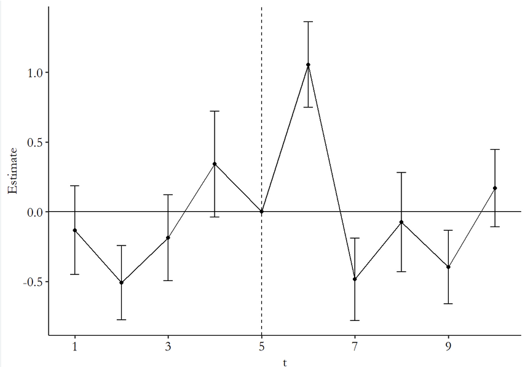
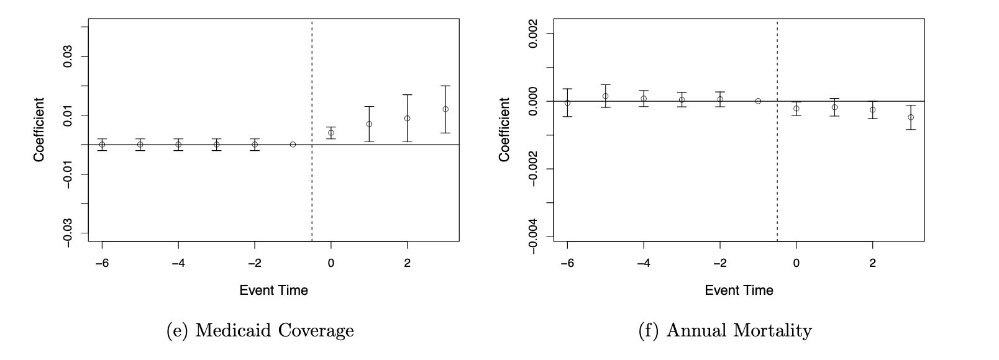
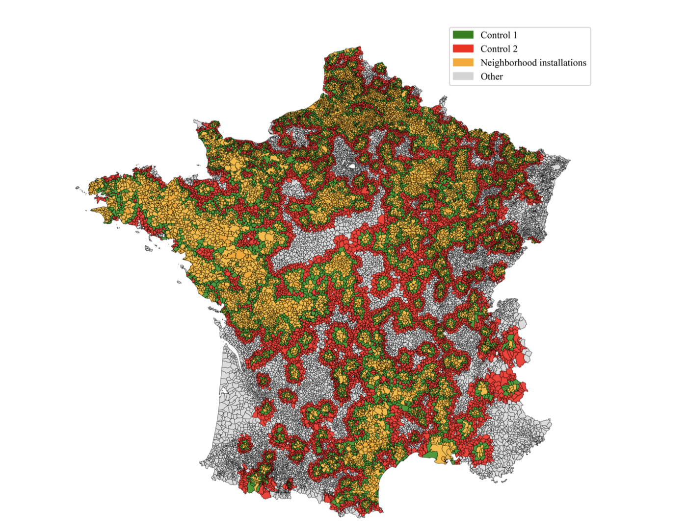
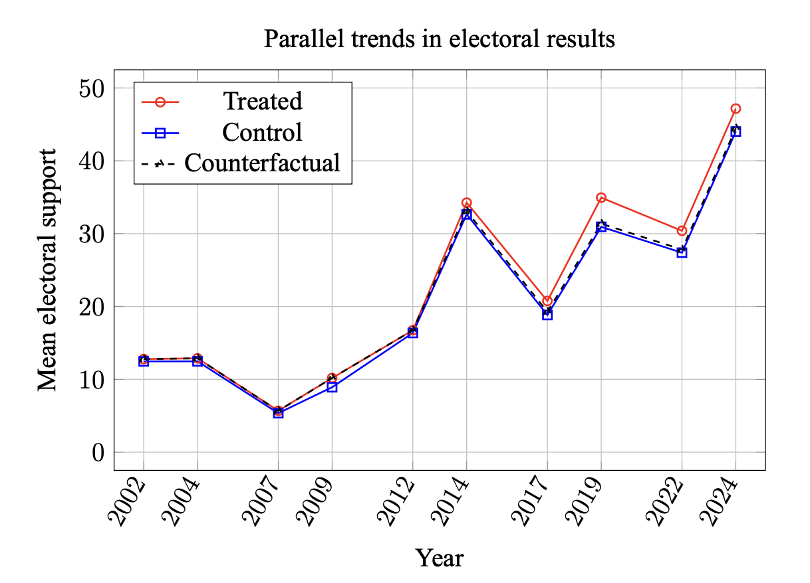
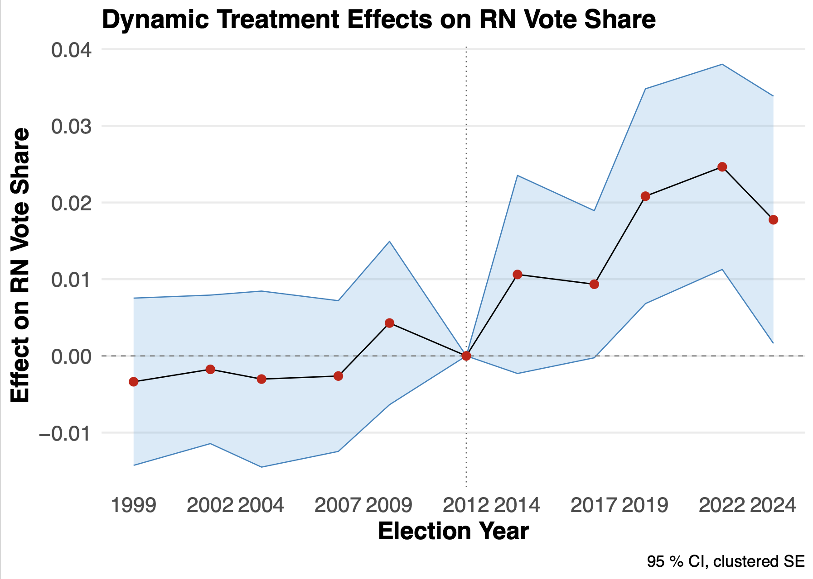

## We saw in previous sessions
- How to describe variables : descriptive statistics
- How to infer from sample to larger population : statistical inference
- How to analyse relations between variables : 
  - When DV is continuous:
    - Indep. variable = categorical : t-test
    e.g. Urban/rural on median income
    - Indep. variable = continuous : linear regressions
    e.g. Far-right vote share in communes and income

## Can you derive causal claims ?
- You can control for variables but...
- Endogeneity
- Omitted variable bias
- Reverse causality

## Today's objectives
- Introduce you to one of the main causal inference methods
- Know what is event-study
- Parallel trend assumption
- Two-way fixed effects
- Other estimators
- Matching

## Causal inference
- $X \rightarrow Y$ 
- Need for so-called **identification strategy**

- Many different strategies :
  - Difference-in-differences (today)
  - Regression discontinuity
  - Instrumental variables


## Difference-in-Differences

- Causal inference of observational data
- Based on event study
- Regression technique
- Compare two groups (control vs treatment)
- Compare Pre and Post treatment
- *Need for panel data* $Y_{it}$

## Event-study
- How does an event impact an outcome ? Compared with a reference

::: {.column width="70%"}


:::

## The Cholera case
- The control and treatment only need to evolve in parallel in pre-treatment
```{r}
#| echo: false
library(ggplot2)
library(tidyverse)
cholera <-data.frame(
    town = rep(c("A", "B"), each = 3),
    year = rep(c(1852, 1853, 1855), times = 2),  # two pre-treatment years + one post
    cholera_cases = c(120, 110, 20, 95, 85, 65)  # hypothetical numbers
)

ggplot(cholera, aes(x = year, y = cholera_cases, color = town, group = town)) +
    geom_line(size = 1.2) +
    geom_point(size = 3) +
    labs(title = "DiD Example: Cholera Cases in two towns",
         y = "Cholera Cases", x = "Year") +
    theme_minimal()

```
## Difference-in-Differences

```{r}
#| echo: false
library(ggplot2)

# Time periods
time <- -5:5

# Control group trend
control <- 2 + 0.5 * time

# Treatment group: parallel pre-treatment trend with baseline shift, add treatment effect after Year 0
treatment <- 3 + 0.5 * time            # starts higher than control but same slope
treatment[time >= 0] <- treatment[time >= 0] + 2  # add treatment effect after Year 0

# Counterfactual for treatment group (if no treatment)
counterfactual <- 3 + 0.5 * time       # continues pre-treatment slope

# Create data frame for ggplot
df <- data.frame(
  Time = rep(time, 3),
  Outcome = c(control, treatment, counterfactual),
  Group = factor(rep(c("Control Group", "Treatment Group", "Counterfactual"), each = length(time)),
                 levels = c("Control Group", "Treatment Group", "Counterfactual"))
)

# ATT segment: vertical line at Time = 0.5 (halfway between 0 and 1) to visualize effect
att_time <- 1
att_start <- counterfactual[time == att_time]  # counterfactual
att_end <- treatment[time == att_time]         # observed treatment
att_df <- data.frame(x = att_time, xend = att_time, y = att_start, yend = att_end)

# Plot
ggplot(df, aes(x = Time, y = Outcome, color = Group, linetype = Group)) +
  geom_line(size = 1.2) +
  geom_point(size = 3) +  # add dots at each year
  geom_segment(data = att_df, aes(x = x, xend = xend, y = y, yend = yend),
               color = "black", linetype = "dashed", size = 1.2,
               arrow = arrow(length = unit(0.2,"cm"))) +  # arrow to highlight ATT
  scale_color_manual(values = c("blue", "red", "red")) +
  scale_linetype_manual(values = c("solid", "solid", "dashed")) +
  geom_vline(xintercept = 0, linetype = "dotted", color = "gray", size = 1) +
  annotate("text", x = 0.5, y = max(treatment) - 1, label = "Treatment starts", angle = 90, color = "gray") +
  labs(title = "Difference-in-Differences Illustration (Parallel Pre-Treatment Trends)",
       x = "Time (Years)",
       y = "Outcome") +
  theme_minimal() +
  theme(text = element_text(size = 14))
```


## The ATT
- ATT = average treatment effect on the treated
- What is generally measured by a DiD
- the difference between the counterfactual $Y_T(1)$ and the actual outcome $Y_T(0)$


## In applied research
- Assessing the impact of Medicare expansion on mortality rates (Miller et al, 2021)

::: {.column width="100%"}


:::

## Why would running a simple regression not work ?

\begin{equation}
\text{Mortality}_{it} = \text{Medicare}_{it} + \epsilon_{it}
\end{equation}
 
- what would you probably observe?

## Why would running a simple regression not work ?
- Selection bias and endogeneity : being eligible to medicare = being older, perhaps in poor health condition 
- Omitted variable bias : depending on your data, you might forget variables to control for, that might impact mortality rate and medicare coverage
- Reverse causality


## Other examples
- Assessing the impact of wind turbine installations on the vote for the far-right

:::: {.columns}

::: {.column width="50%"}

:::

::: {.column width="50%"}

:::

::::
------------------------------------------------------------------------

## Event-study

{fig-align="center"}


------------------------------------------------------------------------


## Difference-in-Differences

\begin{equation}
Y_{it} = \alpha_i + \beta_t + \text{Group_i} + \text{Period}_t + \delta \text{Group_i} \times \text{Period}_t + \epsilon_{it}
\end{equation}

- The causal effect is the interaction effect $\delta$
-  This model is called two-way fixed effects: TWFE
- Good for one homogeneous treatment (eg. a policy switch affecting all states in a certain year)
- More robust and recent estimators exist in the literature (de Chaisemartin &  D'Haultfœuille, 2020; Callaway & Sant'Anna, 2021), for heterogeneous or **staggered treatment**

------------------------------------------------------------------------


## In R
- Panel data *always require clustering of the standard errors*
- In general, at the level at which treatment is applied
::: r-fit-text

`feols(formula|FE,cluster=~group,data)`:

-   formula: Y \~ Time\*Treatment (+controls)

-   FE: fixed effects, in general at the individual and yearly level 

-   cluster=\~group: specify that you want clustered SE (if you do not add this argument, you will have IID SE like in lm)

-   data: name of the dataset

With feols function, the stargazer function does not work. You need to use etable().
:::


## Common pitfalls
- Violation of the parallel trends assumption
- Composition changes in the groups composition
- Spillover effects 
- Time-varying confounders: events happening at the same time
- Not clustered standard errors

## Heterogeneous treatment effects
- A TWFE computes an average over years
- Yet treatment effects are perhaps heterogeneous and dynamic
- You can try running TWFE with interactions, event-study
- Or use more sophisticated estimators : De Chaisemartin & D'Hautefeuille, Callaway & Sant'Anna.

## An example 

Based on the data from Angelucci and Cagé, 2019.

We are interested in understanding how the introduction of advertisements in TV programs in France has impacted the revenues of newspapers throughout France. The hypothesis being that it impacted only national newspapers and not local ones.


## An example {.scrollable}
- Data set on newspapers revenues, can be downloaded [here](https://www.openicpsr.org/openicpsr/project/116438/version/V1/view?path=/openicpsr/116438/fcr:versions/V1/data/dta/Angelucci_Cage_AEJMicro_dataset.dta&type=file).
```{r}
#| echo: true
library(haven)
library(tidyverse)
newspapers <- read_dta("data/Angelucci_Cage_AEJMicro_dataset.dta")

newspapers <-
  newspapers |>
  select(
    year, id_news, after_national, local, national, ra_cst, ps_cst, qtotal
    ) |> 
  mutate(ra_cst_div_qtotal = ra_cst / qtotal, 
         post_treatment =  if_else(year >= 1967, 1, 0),
         across(c(id_news, local, national, after_national), as.factor),
         year = as.factor(year)) %>% rename(treat_group = national)
newspapers
```


## Two-way fixed effects {.scrollable}
```{r}
#| echo: true
library(fixest)

newspapers <- newspapers |>
  mutate(year = as.numeric(as.character(year)),
         treat_group = as.numeric(as.character(treat_group)))

twfe <- feols(
  log(ra_cst) ~ post_treatment*treat_group | id_news + year,
  cluster = ~id_news,
  data = newspapers %>% filter(year == 1966|year == 1967)
)
summary(twfe)

```
## Checking the parallel trends
```{r}
#| echo: true
#| eval: false
newspapers %>%
  group_by(year, treat_group) %>%
  summarise(mean_score = mean(log(ra_cst), na.rm = TRUE), .groups = "drop") %>%
  ggplot(aes(year, mean_score, color = as.factor(treat_group))) +
  geom_line()
```

## Checking the parallel trends
```{r}
#| echo: false
#| eval: true
newspapers %>%
  group_by(year, treat_group) %>%
  summarise(mean_score = mean(log(ra_cst), na.rm = TRUE), .groups = "drop") %>%
  ggplot(aes(year, mean_score, color = as.factor(treat_group))) +
  geom_line()
```

## Event-study
```{r}
#| echo: true
#| eval: false

library(fixest)

newspapers <- newspapers |>
  mutate(year = as.numeric(as.character(year)),
         treat_group = as.numeric(as.character(treat_group)))

event_study <- feols(
  log(ra_cst) ~ i(year, treat_group, ref = "1966") | id_news + year,
  cluster = ~id_news,
  data = newspapers
)

iplot(event_study,
      xlab = "Year",
      ylab = "Effect on log(ra_cst)",
      main = "Event Study: Effect of National Newspapers",
      ref.line = 0)

```


## Event study
```{r}
event_study <- feols(
  log(ra_cst) ~ i(year, treat_group, ref = "1966") | id_news + year,
  cluster = ~id_news,
  data = newspapers
)

iplot(event_study,
      xlab = "Year",
      ylab = "Effect on log(ra_cst)",
      main = "Event Study: Effect of National Newspapers",
      ref.line = 0)

```

## Event-study
- This is for only one treatment timing

\begin{equation}
Y_{it} = \alpha_i + \beta_t + \text{Group_i} + \text{Period}_t + \delta \text{Group_i} \times \text{Period}_t + \epsilon_{it}
\end{equation}

- For staggered treatment : more complex estimators (e.g. Callaway and Sant'Anna, from package `did`)
- Estimates (group,time) effects
- For each treatment period and cohort, an effect is computed.


# Matching 

## Matching
- Ideally you want identical treatment and control groups on all other covariates
- Variables predicting your treatment should also predict your control group
- Matching is useful to
  - reduce bias due to differences between control vs. treatment
  - more credible and transparent comparaison between groups
  
- But does not remove bias from unobserved variables !

## Propensity score matching
- Propensity score = probability to receive treatment depending on covariates 
  1. Decide of important covariates
  2. Estimate propensity scores per individual (logistic regression `glm (Y ~ X, family = "binomial")`)
  3. Associate treatment group with control groups with similar scores
  4. Check covariate balance
  5. Estimate treatment effect

## Types of matching
- Nearest : each treated individual is associated with the closest in the non-treated individuals 
$min(|PSM_t - PSM_c|)$
- Radius : controls lie within a certain radius $|PSM_t - PSM_c| \leq R$
- Kernel : closer controls are associated with higher weights

## Propensity score matching
- Can be used as a standalone method
- Or as pre-processing before DiD

# Exercices

## Exercice 1

- You are asked to evaluate the effect of a **tutoring program** on students’ academic performance. The program is introduced in year 7 and affects only a subset of students, while others remain untreated. You observe a panel dataset that follows the same students over a period of 15 months.