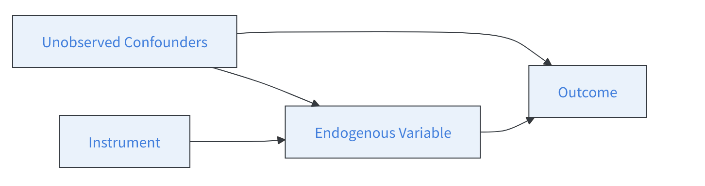
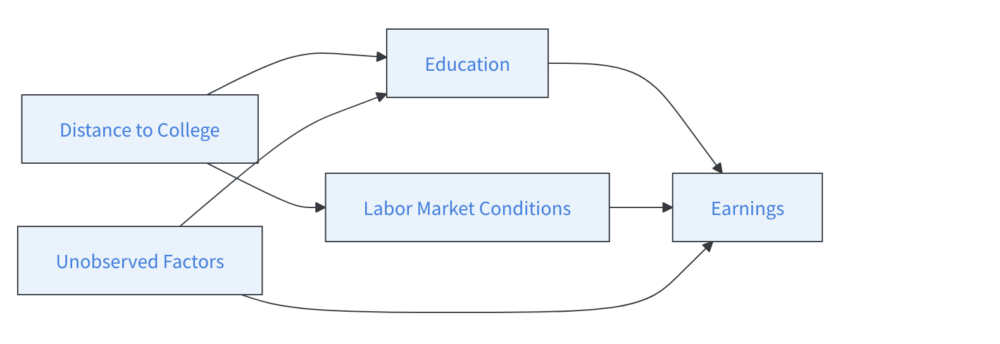

## Last sessions

-   Regressions
-   Difference-in-differences
-   Regression discontinuity

## Identification and exogeneity

-   An OLS is a correlational analysis 

\begin{equation}
    Y_i = \alpha + \beta X_i + \delta D_i + \epsilon_i
\end{equation}

-   Identifying a causal effect (directional) requires exogeneity and directionality
-   $D \rightarrow Y$
-   otherwise bias can arise

## Instrumental variables 




## Two-stage least squares

-   1st stage : 
\begin{equation}
D_i = \alpha + \beta Z_i + \gamma' W_i + \epsilon_i
\end{equation}

-   2nd stage :

\begin{equation}
\hat{D}_i = \hat{\alpha} + \hat{\beta} Z_i + \hat{\gamma'} W_i
\end{equation}


## How to run your IV {.scrollable}

-   Successive `lm`

    -   1st stage `Treatment ~ Instrument + controls`
    -   2nd stage `Outcome ~ fitted_treatment + controls`

-   You want to estimate earnings depending on education

    -   instead of OLS, use of an instrument
    -   distance to school
    
```{r}
#| echo: true

    # Load required package
    library(AER)  # For ivreg (2SLS)
    library(estimatr)
    set.seed(123)

    # Sample size
    n <- 500

    # Instrument: distance to nearest college (in km, exogenous)
    distance_to_college <- runif(n, 0, 50)  # 0 = very close, 50 = far

    # Unobserved confounder: ability or motivation
    ability <- rnorm(n, 0, 1)

    # Treatment: years of education (depends on distance and ability)
    # Students closer to college tend to get more education
    education <- 12 + 0.05 * (50 - distance_to_college) + 0.8 * ability + rnorm(n, 0, 1)
    # education is continuous: years of schooling

    # Outcome: earnings (depends on education and ability)
    earnings <- 20000 + 1500 * education + 5000 * ability + rnorm(n, 0, 5000)

    # Combine into a data frame
    df <- data.frame(earnings, education, distance_to_college, ability)

    # Quick look
    head(df)

    # Naive OLS (biased because of ability confounding)
    lm_first <- lm(education ~ distance_to_college, data = df)

    df$fitted_educ <- lm_first$fitted.values
    ivcom <- lm(earnings ~ fitted_educ, data = df)
    summary(ivcom)


    naive_lm <- lm(earnings ~ education, data = df)
    summary(naive_lm)
```

## Using built-in functions {.scrollable}

-   packages

```{r}
#| echo: true

library(AER)  # For ivreg (2SLS)
library(estimatr)
```

-   Function

```{r}
#| echo: true
#| eval: false
iv <- ivreg(Y ~ X | D+X, data)
```

```{r}
#| echo: true

# 2SLS using distance as instrument
iv_model <- ivreg(earnings ~ education | distance_to_college, data = df)
iv_model2 <- iv_robust(earnings ~ education | distance_to_college, data = df)
summary(iv_model, diagnostics = TRUE)
summary(iv_model2)
```

## Diagnostics

-   Weak instruments : rejected (F statistic \~ 150 \>\> 10)
-   Wu-Hausman test : is education exogeneous ? If yes, OLS would be fine.
-   Sargan test : in case you have multiple instruments


## Conditions of good instrument

1.  Affects the treatment (relevance),

2.  Does not directly affect the outcome except through the treatment (exclusion restriction),

3.  Is independent of unobserved confounders (validity).

## Relevance condition
- Only condition that can be directly tested
```{r}
#| echo: true

summary(iv_model, diagnostics = TRUE)
```
- F > 10 : strong instrument

## Exclusion restriction
- Your only path from your instrument to your outcome is through your treatment



## Exclusion restriction {.scrollable}
- Placebo checks : check placebo outcomes
- Test the influence of your instrument on other outcome variables
- With chronological data : take your outcome, pre-treatment. 
- If significant, suggests another path from I -> Y !

```{r}
#| echo: true

pre_treatment <- rnorm(n)

summary(lm(pre_treatment ~ distance_to_college, data = df))
```
- Yet you can not guarantee anything !

## Exogeneity {.scrollable}
- Even harder to verify


- Test exogeneity on observables
```{r}
#| echo: true
#| eval: false

summary(lm(covariates ~ distance_to_college, data = df))
```

## Instrumental variables
- Require very good institutional knowledge
- You will hardly find one easily
- All hypotheses can not be tested


## Overall {.scrollable}
- Choose method that fits
  - your purposes
  - your data
- OLS
  - continuous DV
- Logistic regression
  - binary DV
- Only correlational ! 
- Difference-in-differences 
  - panel data
  - control vs. treatment
- RDD 
  - abrupt cutoff
- IV
  - Instrument

## Overall
- Causal inference only answers one very specific type of question 
- $X \rightarrow Y$
- Should be complemented by other methods
- Yet can help avoiding wrong conclusions
- And design good policies

## How good research can help


## The CEPII note


## Papers


## Papers


## Papers


# Thank you !

# Exercices

